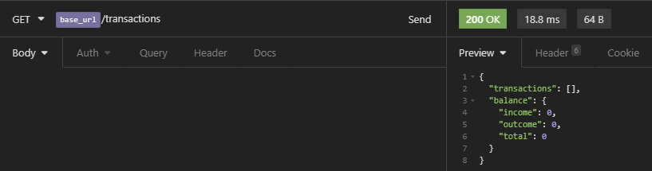
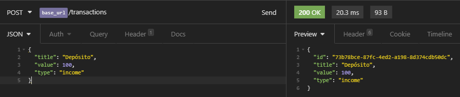
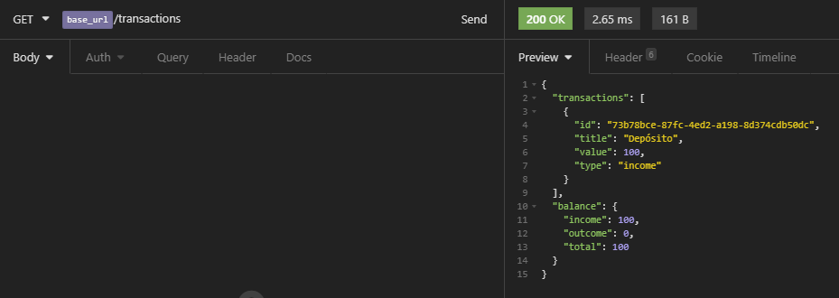
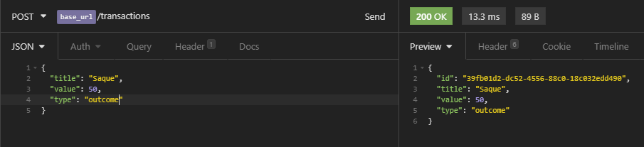

    

    
    
    
    
    
    
    
    
    

  <a href="#-Sobre-o-desafio">🚀 Sobre o desafio</a>&nbsp;&nbsp;&nbsp;|&nbsp;&nbsp;&nbsp;
  <a href="#-Projeto">🚧 Projeto</a>

# 🚀 Sobre o desafio

Nesse desafio, você deve criar uma aplicação para continuar treinando o que você aprendeu até agora no Node.js junto ao TypeScript, utilizando o conceito de models, repositories e services!

Essa será uma aplicação para armazenar transações financeiras de entrada e saída, que deve permitir o cadastro e a listagem dessas transações.

# 🚧 Projeto

    
Utilizando insomnia para ter uma resposta visual:  

    
⚫ Regra de négocio.

    
🟣 Requisição GET.

    
🟢 Requisição POST.  

    
🟣 Inicialmente é feita uma requisição GET á API, como não ha dados na API a lista fica vazia e com o <i>balance</i> zerado. 

    
    
🟢 Requisição POST realizada em seguida, fazendo um depósito (<i>income</i>) de <i>value</i> 100.

    
    
🟣 Requisição GET mostrando todas <i>transactions</i> cadastradas, ja realizando o <i>balance</i>, como foi criado apenas uma <i>transaction</i> mostra apenas aquela na requisição.

    
    
🟢 Requisição POST realizada em seguida, fazendo um saque (<i>outcome</i>) de <i>value</i> 50.

    
    
🟣 Requisição GET mostrando todas <i>transactions</i> cadastradas, ja realizando o <i>balance</i>.

    
    
⚫ Requisição POST mostrando uma regra de négocio em funcionamento, quando se tenta sacar mais do que se tem depósitado.

    
    
⚫ Requisição POST mostrando uma regra de négocio em funcionamento, quando se tenta sacar valores negativos ou 0 (zero).

    
    
⚫ Requisição POST mostrando uma regra de négocio em funcionamento, quando se tenta depósitar valores negativos ou 0 (zero).

    
    
⚫ Requisição POST mostrando uma regra de négocio em funcionamento, quando tenta fazer um cadastro com o <i>type</i> diferente de (<i>income | outcome</i>).

    

---

Desenvolvido com 💚 por [Felipe Zanetti!](https://www.linkedin.com/in/felipezanetti/)
